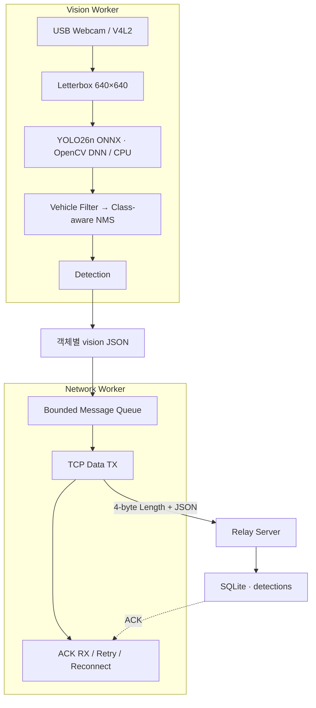

<p align="center">
  
  
  
  
  
</p>

<p align="center">
  <a href="#validation">Validation</a> · <a href="#demo">Demo</a> · <a href="#performance">Performance</a> · <a href="#architecture">Architecture</a> · <a href="#reliability">Reliability</a> · <a href="#build">Build</a>
</p>

# Raspberry Pi Edge Vision

**Raspberry Pi 4에서 USB Webcam 영상을 YOLO26n ONNX로 처리해 차량 Detection을 생성하고, 객체별 JSON을 TCP/ACK 방식으로 전달하는 C++17 Vision Client입니다.**

독립 검증용 [Relay Server](https://github.com/triton0305/pi-edge-vision-relay-server)를 구현해 Raspberry Pi Client → TCP → Relay Server → SQLite → ACK 전체 경로를 검증했습니다.

> **Jetson 확장:** 기존 Vision 파이프라인을 Jetson Nano로 이식하고 OpenCV DNN / CPU 추론을 TensorRT FP16 / CUDA GPU 추론으로 전환한 [Jetson Edge Vision](https://github.com/triton0305/jetson-edge-vision)으로 확장했습니다.

## Development History

| 날짜 | 개발 내용 |
|---|---|
| [2026.09.21](https://github.com/triton0305/raspberry-pi-edge-vision/commit/e4134629aa3aff191d54960b538f36fbbebda7dd) | Raspberry Pi 기반 Edge Vision 초기 파이프라인 구현 |
| [2026.09.22](https://github.com/triton0305/raspberry-pi-edge-vision/commit/f15bc1c34588f2f3ce497a2b0ca1502419ec9ed2) | JSON / ACK 신뢰성 전송, Vision·Network 분리, Bounded Queue 기반 Runtime 구조 완성 |
| [2026.09.23](https://github.com/triton0305/raspberry-pi-edge-vision/commit/24fb74c877b88c2b1f7bd62b31e380f0980da2e6) | Network 장애와 Vision Runtime을 분리하고 독립 실행·재연결 구조 보강 |
| [2026.09.28](https://github.com/triton0305/raspberry-pi-edge-vision/commit/be97376e2b1de833faf7a85f258c8687d2c2e938) | Tracking / Line Crossing / traffic_count 실험 후 최종 Runtime을 Vision-only 구조로 확정 |

## Validation

USB Webcam 입력부터 OpenCV DNN 추론, 객체별 Vision 생성, TCP 전송, SQLite 저장 및 ACK까지 전체 경로를 검증했습니다.

| 검증 범위 | 확인 항목 | 결과 |
|---|---|:---:|
| Vision | USB Webcam · YOLO26n ONNX · OpenCV DNN / CPU · 차량 탐지 / NMS | PASS |
| E2E | Raspberry Pi → Relay Server → SQLite → ACK | PASS |
| 전송 / 신뢰성 | Length-prefix · Partial I/O · ACK / Retry · 중복 저장 방지 | PASS |
| 장애 / 복구 | ACK Timeout · Disconnect / Reconnect · Server 미실행 시 Vision 유지 | PASS |
| 데이터 | 객체별 Vision 저장 · `timestamp_ms` 유지 · Detection 의미 검증 | PASS |

<details>
<summary><strong>검증 및 트러블슈팅 상세</strong></summary>

| 검증 항목 | 확인 내용 |
|---|---|
| E2E Vision | USB Webcam → Pi Client → TCP → Relay Server → SQLite → ACK |
| ACK / Retry | Timeout 후 동일 `message_id` / payload 재전송 |
| 중복 방지 | 동일 `message_id` 재전송 후 SQLite 신규 행 미생성 |
| Network Fault | Server 미실행 / 연결 종료 후에도 Vision Loop 유지 |
| Reconnect | 연결 실패 이후 Network Worker 재연결 |
| Traffic Experiment | Tracking · Line Crossing · `traffic_count` 실험 후 최종 Runtime에서 제외 |

**TCP Stream 경계와 Partial I/O** — TCP는 한 번의 `send()`와 `recv()`가 하나의 메시지 경계를 보장하지 않기 때문에 JSON 앞에 `4-byte big-endian payload length`를 추가했습니다. Header와 Payload 모두 일부만 송수신될 수 있으므로 필요한 바이트를 끝까지 처리하도록 구현했습니다.

```text
4-byte big-endian payload length
+
JSON payload
```

**ACK 유실 → Retry → DB 중복 저장** — Server가 SQLite 저장을 완료했지만 ACK만 유실되면 Client는 동일 Detection을 다시 전송할 수 있습니다. Retry 시 새로운 메시지를 만들지 않고 동일한 `message_id`와 payload를 유지하고, Relay Server에서는 `message_id` UNIQUE 제약과 `INSERT OR IGNORE`를 사용해 동일 Detection이 다시 도착해도 신규 DB row가 생성되지 않도록 구성했습니다.

```text
Detection
→ JSON
→ TCP
→ SQLite
→ ACK

ACK Timeout / Disconnect
→ Reconnect
→ Same message_id
→ Same payload
→ Retry
```

**ACK의 의미와 전송 시점** — JSON을 수신하자마자 ACK를 반환하면 이후 DB 저장이 실패했을 때 Client는 성공으로 판단할 수 있습니다. 따라서 ACK는 단순 TCP 수신 확인이 아니라 Server 처리 결과를 나타내도록 구성하고, DB 저장 처리 이후 반환합니다.

```text
Receive
→ Validate
→ DB Write
→ ACK
```

**프로그램 재시작과 Message Identity** — 단순 sequence만 사용하면 프로그램 재시작 후 값이 다시 초기화되어 이전 실행과 `message_id`가 충돌할 수 있습니다. 이를 방지하기 위해 다음 구조를 사용합니다.

```text
<device_id>-<boot_id>-<sequence>
```

`boot_id`는 파일에 영속적으로 저장하고 프로그램 시작 시 증가시킵니다. `frame_id`는 현재 실행 내 프레임 순서를 나타내고, `message_id`는 네트워크 재전송과 DB 중복 방지를 위한 메시지 식별자로 분리했습니다.

**Vision / Network 장애 분리** — 초기에는 Relay Server 연결 실패가 Vision Runtime 종료로 이어질 수 있었습니다. Camera와 YOLO 처리가 Network 상태에 종속되지 않도록 Vision 처리와 Network 전송을 분리했습니다.

```text
Vision Worker
Camera
→ YOLO
→ Detection
      ↓
Message Queue
      ↓
Network Worker
→ TCP
→ ACK / Retry
```

Relay Server가 실행되지 않았거나 연결이 끊겨도 Vision Loop는 계속 동작하고, Network Worker가 별도로 재연결을 수행합니다.

**Producer / Consumer 처리량 차이** — Vision Worker와 Network Worker를 분리하면 Detection 생성 속도와 TCP/ACK 처리 속도가 항상 같다는 보장이 없습니다. Network 지연이나 Server 응답 지연으로 메시지가 계속 쌓여 메모리 사용량이 증가하지 않도록 Bounded Queue를 사용하고 Queue depth와 Drop 수를 Metrics로 확인하도록 구성했습니다.

```text
Vision Worker
    ↓ Producer
Bounded Queue
    ↓ Consumer
Network Worker
```

**Detection과 Protocol / DB 단위 정렬** — 한 프레임에서 여러 차량이 탐지될 수 있으므로 Frame 전체를 하나의 배열 메시지로 묶는 대신 객체 Detection 단위로 전송과 저장 의미를 맞췄습니다.

```text
Detection 1개
=
vision JSON 1개
=
message_id 1개
=
TCP 전송 단위 1개
=
SQLite detections row 1개
=
ACK 1개
```

같은 Frame에서 차량 여러 대가 탐지되면 동일한 `frame_id`를 공유하지만 각 Detection은 독립적인 `message_id`를 가집니다.

**NMS와 Tracking의 역할 구분** — 반복 Detection을 검토하면서 NMS와 Tracking이 서로 다른 문제를 해결한다는 점을 구분했습니다.

```text
NMS
→ 같은 Frame 내부의 중복 Detection 제거

Tracking
→ 서로 다른 Frame 사이에서 동일 객체 연결
```

따라서 NMS를 적용하더라도 동일 차량이 여러 프레임에서 반복 Detection으로 생성되는 것은 정상입니다.

**Traffic Counting 실험과 Scope 재설계** — 반복 Detection을 줄이고 차량 통과량을 계산하기 위해 Tracker와 Line Crossing 기반 `traffic_count`를 구현해 E2E 테스트를 진행했습니다.

```text
Detection
→ Tracker
→ track_id
→ Line Crossing
→ traffic_count
```

테스트 과정에서 Detection History와 실제 차량 통과량은 서로 다른 의미를 가진다는 점을 명확히 했습니다. 시간 구간이나 집계 기준이 달라질 때마다 Edge Client를 수정하는 구조보다 Client는 원본 Detection 생성과 전달에 집중하고, 필요한 통계는 저장된 데이터를 기반으로 Server에서 후처리하는 구조가 더 적합하다고 판단했습니다.

최종 Runtime에서는 Tracker, Line Crossing, `traffic_count`를 실행 경로에서 제외했습니다.

```text
Raspberry Pi Client
Camera
→ YOLO Detection
→ vision JSON
→ Queue
→ TCP / ACK

Relay Server
→ Detection 저장
→ timestamp_ms 기반 후처리
```

**Event Time과 Arrival Time 분리** — Network 지연이나 Retry로 Detection이 늦게 도착할 수 있기 때문에 Server 도착 시각을 데이터 발생 시각으로 사용하지 않습니다.

```text
Detection 발생
10:59:59
    ↓
Network 지연 / Retry
    ↓
Server 도착
11:00:02
```

시간 구간별 후처리는 Client에서 Frame을 처리할 때 생성한 원본 `timestamp_ms`를 기준으로 수행하도록 정의했습니다.

**Letterbox 좌표계 복원** — Camera 원본 프레임은 640×480이고 YOLO 입력은 640×640이므로 Letterbox 과정에서 Scale과 Padding이 적용됩니다.

```text
Original Frame
640×480
    ↓
Letterbox
    ↓
Model Input
640×640
    ↓
Detection
    ↓
Scale / Padding 역변환
    ↓
Original Coordinate
```

Post-processing에서 Letterbox 변환을 역으로 적용해 Server에 전달하는 `bbox`는 모델 입력 좌표가 아니라 **원본 640×480 프레임 기준 좌표**로 유지합니다.

**Client / Server 구현 언어 분리** — Vision Client는 C++17, Relay Server는 C11로 구현했습니다. 두 프로그램을 같은 코드나 자료구조에 결합하지 않고 Network Protocol을 Interface로 사용했습니다.

```text
C++ Vision Client
        ↓
Length-prefix
+ JSON Protocol
        ↓
C Relay Server
```

이를 통해 Client와 Server는 서로 다른 언어로 구현하면서도 Framing, JSON Envelope, `message_id`, `timestamp_ms`, ACK 규칙만 공유하도록 구성했습니다.

**Model Capability와 Application Requirement 분리** — YOLO는 전체 COCO Class를 출력하지만 이 프로젝트에서 사용하는 대상은 차량 관련 네 종류입니다.

```text
YOLO Output
    ↓
Class Filter
    ↓
car
motorcycle
bus
truck
    ↓
Class-aware NMS
```

모델 자체를 변경하지 않고 Post-processing 단계에서 필요한 Class만 선택해 범용 Object Detection Model과 Application 요구사항을 분리했습니다.

</details>

## Demo

<p align="center">
  
</p>

<p align="center"><sub>USB Webcam / OpenCV DNN 차량 탐지 결과</sub></p>

## Performance

Raspberry Pi 4 CPU 환경에서 측정한 결과입니다. 장면과 실행 조건에 따라 실제 값은 달라질 수 있습니다.

| Camera Frame Grab | 영상 처리 | 평균 추론 시간 |
|:---:|:---:|:---:|
| **약 21.6 FPS** | **약 2.2–2.34 FPS** | **약 405–425 ms** |
| Frame Grab | Effective FPS | OpenCV DNN / CPU |

Effective FPS는 Camera의 Frame Grab 속도가 아니라 전처리, YOLO 추론, 후처리를 포함한 실제 Vision 처리 속도입니다.

## Key Features

| 영역 | 구현 내용 |
|---|---|
| **Perception** | `car`, `motorcycle`, `bus`, `truck` · YOLO26n ONNX · OpenCV DNN / CPU · Class-aware NMS |
| **Message** | Detection 1개당 `vision` JSON 1개 · `message_id` 1개 |
| **Delivery** | Bounded Message Queue · Network Worker · TCP length-prefix · Partial I/O |
| **Reliability** | ACK 검증 · Timeout · Retry · Reconnect · 동일 payload / ID 재전송 |
| **Storage** | SQLite `detections` · `message_id` UNIQUE · 중복 저장 방지 |
| **Operations** | FPS · Inference · Queue · Drop Metrics · `/opt`, `/var/lib` 운영 배포 |

전송 데이터는 객체별 Detection 이력이며 고유 차량 수나 실제 통과 교통량을 의미하지 않습니다.

## Architecture



| Stage | Flow |
|---|---|
| **① Vision Loop** | USB Webcam → Letterbox → YOLO26n ONNX → Class Filter → Class-aware NMS |
| **② Message Generation** | Detection → 객체별 `vision` JSON → Message Queue |
| **③ Delivery** | Network Worker → TCP → Relay Server |
| **④ Reliability** | SQLite 저장 → ACK → Timeout / Retry / Reconnect |

| Component | Responsibility |
|---|---|
| **Vision Client** | 프레임 획득 · 전처리 · 추론 · 후처리 · Detection · JSON · Queue · TCP/ACK |
| **Relay Server** | JSON 검증 · SQLite 저장 · 중복 저장 방지 · ACK 반환 |
| **Server-side Analysis** | 저장된 Detection을 `timestamp_ms` 기준으로 조회·집계 |

## Reliability

| 상황 | 처리 |
|---|---|
| **정상 전송** | Vision 송신 → SQLite 처리 → ACK 확인 |
| **송신 / ACK 실패** | 동일 `message_id`와 payload로 Retry |
| **ACK Timeout** | 재연결 후 동일 메시지 재전송 |
| **Connection Lost** | Vision Loop 유지 · Network Worker 재연결 |
| **Duplicate Retry** | SQLite `message_id` UNIQUE로 신규 행 방지 |
| **Server Error ACK** | 일반 Network 장애와 구분하여 처리 |
| **Queue 증가** | Bounded Queue 및 Drop Metrics로 제한 |

일반 `vision` 메시지는 최초 전송을 포함해 최대 3회 시도하며 Retry 시 `message_id`, `frame_id`, `timestamp_ms`, payload를 새로 생성하지 않습니다.

## Build

### Requirements

- C++17 compiler
- CMake
- OpenCV
  - core
  - imgproc
  - imgcodecs
  - highgui
  - videoio
  - dnn
- nlohmann/json
- YOLO26n ONNX model

YOLO26n ONNX 모델은 Repository에 포함하지 않으며 별도로 준비합니다.

```text
models/yolo26n.onnx
```

Repository 루트에서 빌드합니다.

```bash
cmake -S . -B build
cmake --build build -j
```

빌드 결과:

```text
build/bin/edge_vision
```

### Development Run

```bash
./build/bin/edge_vision <server_ip> <server_port>
```

개발 환경의 기본 Runtime 경로:

| 항목 | 경로 |
|---|---|
| Model | `models/yolo26n.onnx` |
| Boot ID | `boot_id.dat` |

현재 Runtime은 OpenCV HighGUI로 Detection 화면을 표시하므로 GUI를 사용할 수 있는 환경에서 실행해야 합니다.

## Deployment

<details>
<summary><strong>운영 계정·설치·실행 방법</strong></summary>

운영 환경에서는 개발 Repository와 Runtime 파일을 분리합니다.

```text
/opt/edge_vision/
├── bin/
│   └── edge_vision
└── models/
    └── yolo26n.onnx

/var/lib/edge_vision/
└── boot_id.dat
```

Deployment Build:

```bash
cmake -S . -B build-deploy \
  -DMODEL_PATH=/opt/edge_vision/models/yolo26n.onnx \
  -DBOOT_ID_PATH=/var/lib/edge_vision/boot_id.dat

cmake --build build-deploy -j
```

운영 바이너리 설치:

```bash
sudo install -m 755 \
  build-deploy/bin/edge_vision \
  /opt/edge_vision/bin/edge_vision
```

운영 전용 계정 `edgevision`은 USB Webcam에 접근할 수 있어야 하며 `/var/lib/edge_vision/boot_id.dat`에 대한 쓰기 권한이 필요합니다.

### Production Run

Repository 루트의 `pirun`을 사용합니다.

```bash
./pirun <server_ip> <server_port>
```

`pirun`은 내부적으로 다음 바이너리를 `edgevision` 계정으로 실행합니다.

```bash
sudo -u edgevision \
  /opt/edge_vision/bin/edge_vision \
  <server_ip> <server_port>
```

Relay Server의 빌드 및 실행 방법은 [Raspberry Pi Edge Vision Relay Server](https://github.com/triton0305/pi-edge-vision-relay-server)를 참고합니다.

</details>

## Message Protocol

<details>
<summary><strong>Vision / ACK JSON과 필드 정의</strong></summary>

Vision과 ACK는 `4-byte big-endian payload length + JSON` 형식으로 전달합니다.

```text
4-byte big-endian payload length
+
UTF-8 JSON payload
```

Vision:

```json
{
  "version": 1,
  "type": "vision",
  "device_id": "vision-pi-01",
  "message_id": "vision-pi-01-000059-00000001",
  "data": {
    "frame_id": 0,
    "timestamp_ms": 1790580489875,
    "class_id": 2,
    "class_name": "car",
    "confidence": 0.2803,
    "bbox": {
      "x": 131,
      "y": 328,
      "width": 85,
      "height": 70
    }
  }
}
```

ACK:

```json
{
  "version": 1,
  "type": "ack",
  "message_id": "vision-pi-01-000059-00000001",
  "status": "ok"
}
```

| 필드 | 기준 |
|---|---|
| `message_id` | `device_id + boot_id + sequence` |
| `frame_id` | 현재 실행 내 프레임 순서 |
| `timestamp_ms` | 프레임 획득 직후 Unix ms |
| `bbox` | 원본 640×480 영상 기준 픽셀 좌표 |

검증 실패 시 Relay Server는 Error ACK를 반환합니다.

Retry는 새로운 Detection을 생성하는 동작이 아니라 **기존 메시지를 그대로 다시 전송하는 동작**입니다.

</details>

## Scope and Data Semantics

- Detection이 없는 프레임은 `vision` 메시지를 생성하지 않습니다.
- 동일 차량이 여러 추론 프레임에서 반복 탐지되면 각각 별도의 Detection 이력으로 저장합니다.
- Detection 건수는 실제 고유 차량 대수를 의미하지 않습니다.
- Detection 건수는 기준선 통과 차량 수나 실제 누적 교통량을 의미하지 않습니다.
- Detection 결과만으로 도로 전체의 절대적인 혼잡도를 의미한다고 해석하지 않습니다.
- 시간 구간별 통계는 Server가 저장된 `timestamp_ms`를 기준으로 계산합니다.
- Network 지연이나 Retry로 늦게 도착한 데이터도 Server 수신 시각이 아닌 원래 `timestamp_ms`가 속한 시간 구간에 반영합니다.
- Tracking, Line Crossing, `traffic_count`, `traffic_state`는 현재 Runtime에 포함하지 않습니다.

차종별 Detection 비율을 계산할 경우:

```text
특정 차종 Detection 건수
÷
전체 차량 Detection 건수
×
100
```

전체 차량 Detection은 `car`, `motorcycle`, `bus`, `truck` Detection의 합이며 동일 차량의 반복 Detection도 포함합니다.

이 비율은 실제 도로의 차량 구성비가 아니라 Detection 결과 기준 통계입니다.

## Project Structure

<details>
<summary><strong>소스 디렉터리와 책임</strong></summary>

```text
.
├── include/
│   ├── core/
│   ├── vision/
│   ├── protocol/
│   └── network/
├── src/
│   ├── core/
│   ├── vision/
│   ├── protocol/
│   ├── network/
│   └── main.cpp
├── test/
├── CMakeLists.txt
└── pirun
```

| 경로 | 역할 |
|---|---|
| `include/ · src/core/` | Config · Boot ID · Message ID · Metrics |
| `include/ · src/vision/` | Camera · Letterbox · OpenCV DNN · Post-processing |
| `include/ · src/protocol/` | JSON 직렬화 · Message Protocol |
| `include/ · src/network/` | Message Queue · TCP · ACK · Retry · Reconnect |
| `src/main.cpp` | 컴포넌트 초기화 · Thread · Runtime Lifecycle |
| `test/` | 입력 이미지 및 Vision 검증 결과 |

</details>

## Traffic Feature Decision

<details>
<summary><strong>Tracking / Traffic Counting 실험과 최종 결정</strong></summary>

개발 과정에서 Tracking과 Line Crossing 기반의 5초 `traffic_count` 기능을 구현하고 E2E 테스트를 진행했습니다.

```text
Detection
→ Tracker
→ track_id
→ Line Crossing
→ traffic_count
```

테스트 결과와 데이터 활용 목적을 다시 검토한 뒤 최종 Runtime의 역할을 **객체별 Detection 이력 생성 및 안정적인 전달**로 확정했습니다.

현재 저장소에는 Tracker 및 Traffic Counting 관련 일부 소스가 남아 있지만 현재 Vision Runtime 실행 경로에서는 호출하지 않습니다.

`traffic_state` 역시 대안으로 검토했지만 현재 기능 범위에는 포함하지 않습니다.

</details>

## Related Repositories

| 저장소 | 역할 |
|---|---|
| **이 저장소 · Raspberry Pi Edge Vision** | OpenCV DNN 기반 차량 Detection · TCP/ACK Vision Client |
| [Raspberry Pi Edge Vision Relay Server](https://github.com/triton0305/pi-edge-vision-relay-server) | Vision 검증 · SQLite 저장 · ACK / 중복 방지 |
| [Jetson Edge Vision](https://github.com/triton0305/jetson-edge-vision) | TensorRT FP16 / CUDA GPU 기반 후속 확장 프로젝트 |

## Future Extensions

- systemd 기반 자동 실행 및 장애 시 재시작
- Camera 장애 복구
- 장시간 Runtime 안정성 검증
- 장기 Network 장애 상황의 Queue / Drop 정책 보완
- Server-side Detection 통계 조회
- 시각화
- 데이터 보관 및 삭제 정책
